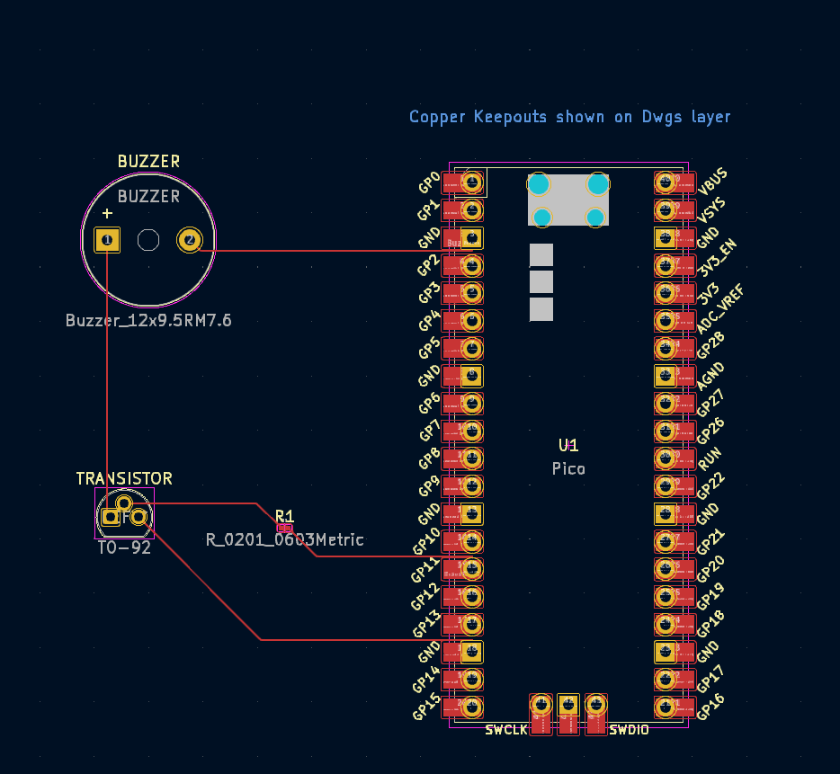

# Projeto de PCB com Raspberry Pi Pico

## Visão Geral do Projeto
Este projeto é um design de Placa de Circuito Impresso (PCB) para o Raspberry Pi Pico. A PCB foi projetada para controlar um buzzer por meio de um pino GPIO, utilizando um transistor BC337 como chave para acionar o buzzer. Este circuito é um exemplo prático de como o Raspberry Pi Pico pode ser usado para interações com o mundo real, permitindo o aprendizado e desenvolvimento de habilidades em eletrônica e programação.

## Funcionalidade do Circuito
O circuito é capaz de acionar um buzzer, que serve como um indicador sonoro. Através de um sinal digital enviado pelo Raspberry Pi Pico ao transistor BC337, o buzzer é ativado e emite um som. Isso pode ser utilizado para alertas, confirmações de ação ou para qualquer outra funcionalidade que requeira uma resposta auditiva.

## Estrutura do Repositório
O repositório está organizado da seguinte forma:
- `imagens`: Contém as imagens dos esquemas e do layout da PCB.
  - `esquematico.png`: Imagem do esquemático do circuito.
  - `pcb.png`: Imagem do layout da PCB.
- `projeto`: Diretório com os arquivos de design do projeto, como os arquivos `.sch` e `.kicad_pcb`.

## Imagens do Projeto

### Esquemático

### PCB

---

README criado por [SeuNome]
